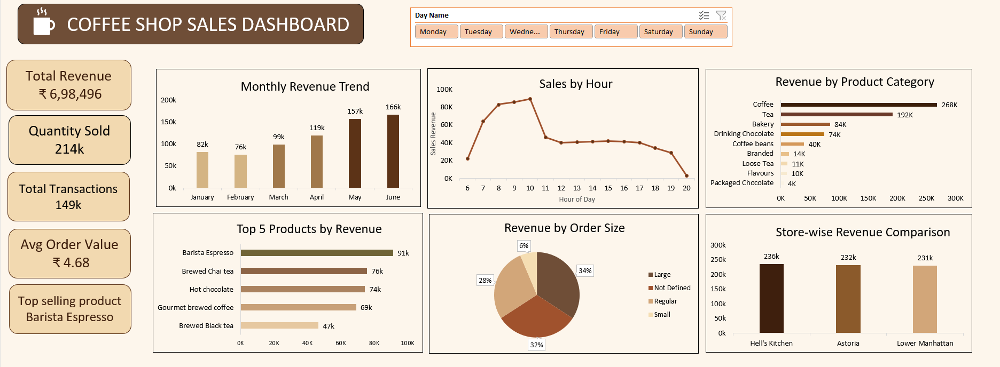

# ☕ Coffee Shop Sales Dashboard

##  Dashboard Preview

##  Dashboard Features
- Total Revenue, Quantity Sold, Total Transactions, Avg Order Value
- Monthly Revenue Trend
- Sales by Hour of Day
- Revenue by Product Category
- Top 5 Products by Revenue
- Revenue by Order Size
- Store-wise Revenue Comparison
- Day Name Slicer (filter by Monday to Sunday)

##  Tools Used
- Microsoft Excel
- Pivot Tables
- Slicers
- Charts & Data Visualization

##  File Structure
- `coffee` sheet — Raw Data
- `pivot` sheet — Pivot Tables
- `dash` sheet — Final Dashboard

##  Key Insights
- Top Selling Product: Barista Espresso
- Highest Revenue Month: June
- Sales peak during morning hours
- Best Performing Store: Hell's Kitchen
- Coffee generated the highest revenue
